# 一、文档地址：http://www.webgl3d.cn/pages/2e5d69/

# 二、三要素
- 场景
- 相机
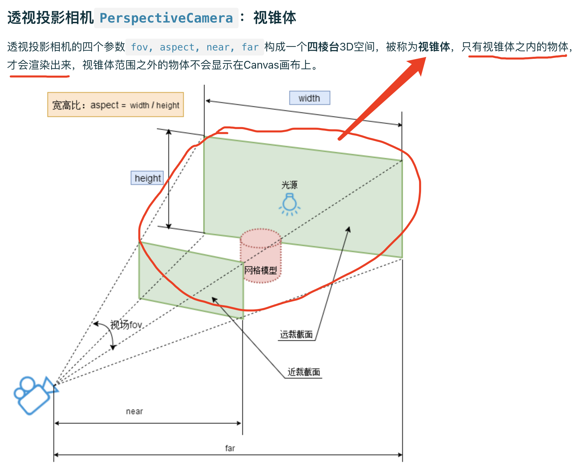
- 渲染器
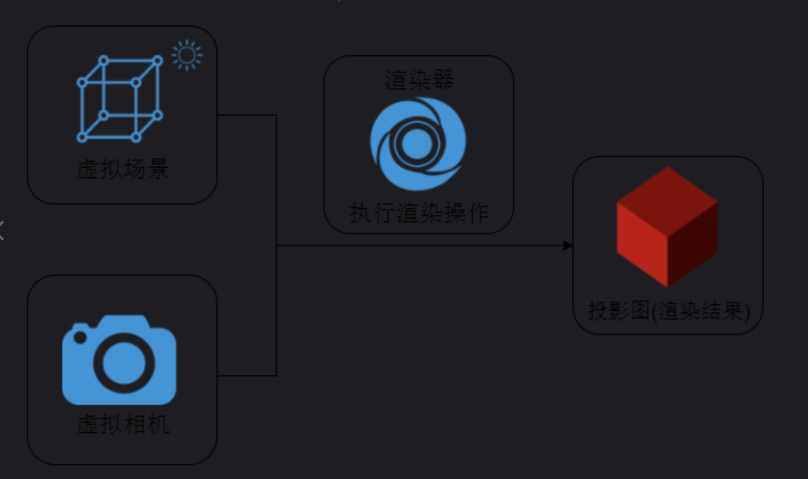

# 三、已完成示例
  ## 2. 几何体BufferGeometry
  节省顶点数据定义，可以使用顶点索引数据。
  索引数据来源可以是顶点，也可以是顶点法线数据。
  ## 4. 层级模型
  ### （1）组对象Group、层级模型
  ### （5）移除对象 remove()
  三维物体（Object3D）的方法，可以从当前对象的子级(.children)中移除对象。
  ```
    group.remove(mesh1, mesh2)
    scene.remove(directionalLight)
  ```
  ### （6）模型隐藏或显示
  三维物体（Object3D）、材质（Material）都有 .visible 属性，类型为 Boolean，决定物体、材质是否可见。
  ```
    group.visible = false
    mesh1.material.visible = false // 共享该材质的所有 mesh 都会隐藏
  ```   
  ## 5. 顶点 UV 坐标、纹理贴图
  ### （1）创建纹理贴图
  ```
    // 纹理贴图加载器 TextureLoader
    const texLoader = new THREE.TextureLoader() 
    // 返回一个纹理对象  
    const texture = texLoader.load('./earth.jpg')

    const material = new THREE.MeshBasicMaterial({
      // color: 0x00ffff
      // map：颜色贴图属性
      // 之所以叫颜色贴图，就是因为会获得贴图的颜色值到网格模型上
      // 一般设置 map 后不需要再设置 color，因为颜色会混合
      map: texture
    })
  ```  
  ### （2）自定义顶点 UV 坐标
  ``` 
    // 顶点 UV 坐标 geometry.attributes.uv 和 顶点位置坐标 geometry.attributes.position 是一一对应的
    // UV 顶点坐标在 0～1 之间，具体怎么设置，取决于你想把图片的哪部分映射到 Mesh 的几何体表面
    const uvs = new Float32Array([
      0, 0,
      0.3, 0,
      0.3, 0.3,
      0, 0.3
    ])
    // 设置 uv 属性
    geometry.attributes.uv = new THREE.BufferAttribute(uvs, 2)
  ``` 
  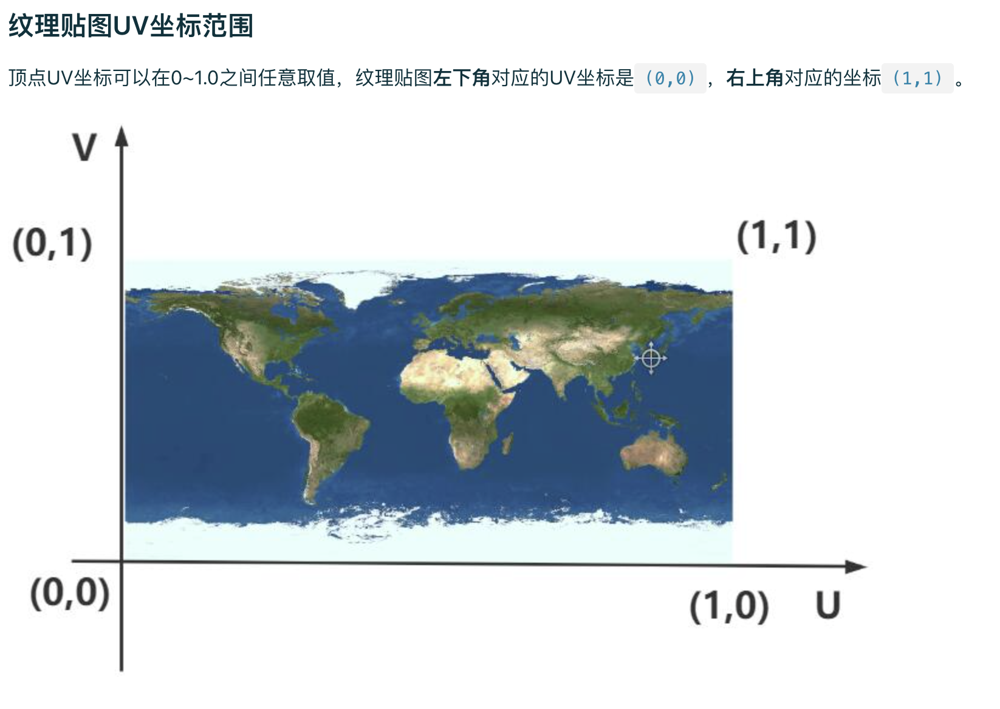

  ### （3）圆形平面设置纹理贴图
  CircleGeometry 的 UV 坐标默认就是一个圆形。
  
  ### （4）纹理对象 Texture 阵列
  ``` 
    texture.wrapS = THREE.RepeatWrapping // 水平方向如何映射
    texture.wrapT = THREE.RepeatWrapping // 垂直方向如何映射
    texture.repeat.x = 20 // 水平方向重复个数，注意选择合适的阵列数量
    texture.repeat.y = 20 // 水平方向重复个数，注意选择合适的阵列数量
  ``` 

  ### （5）矩形 Mesh + 背景透明 png 贴图
  ```
    const material = new THREE.MeshBasicMaterial({
      map: texture,
      // 开启透明计算
      transparent: true
    })
  ```

  ### （6）UV 动画
  ```
    // offset 范围是 0 - 1，是指贴图从开始偏移多少，本质还是改变 UV 坐标
    // 其实就是这个贴图的百分比
    // texture.offset.x = 0.8
    // texture.offset.y = 0.5

    // 渲染循环
    function render() {
      texture.offset.x += 0.01 // 设置纹理动画
      renderer.render(scene, camera)
      requestAnimationFrame(render)
    }
  ```
## 6. 加载外部三维模型(gltf)
  ### （1~2）建模软件绘制3D场景、GLTF格式简介 (Web3D领域JPG)
    - 美术导出 3D 模型，导出 GLTF 等常见格式
    - 程序负责加载解析模型
  ### （3）加载.gltf文件(模型加载全流程)
    ```
      // 引入 GLTFLoader.js gltf 模型加载器
      import { GLTFLoader } from 'three/addons/loaders/GLTFLoader.js'
      // 实例化加载器对象
      const loader = new GLTFLoader()
      // 加载模型
      loader.load( 'gltf模型.gltf', function ( gltf ) {
        console.log('控制台查看加载 gltf 文件返回的对象结构',gltf);
        console.log('gltf 对象场景属性',gltf.scene);
        // 返回的场景对象 gltf.scene 插入到 threejs 场景中
        scene.add( gltf.scene );
      })
      // 设置合适的相机参数
        // position、lookAt、far、near 等
      // 解决纹理贴图颜色偏差
      renderer.outputEncoding = THREE.sRGBEncoding // 新版本已经不需要
    ```
  ### （4）OrbitControls 辅助设置相机参数
    ```
      // 在给出一个大概的值后，可以通过 OrbitControls，可视化设置相机参数
      function render() {
        requestAnimationFrame(render)
        console.log('camera.position', camera.position)
        console.log('controls.target', controls.target)
      }
      render()
    ```
  ### （5～6）gltf不同文件形式(.glb)、模型命名(程序与美术协作)
    ```
      - 单独.gltf文件
      - 单独.glb文件
      - .gltf + .bin + 贴图文件

      - .getObjectByName()根据.name获取模型节点
      - 分组 group 管理，更清晰
    ```
  ### （7）递归遍历层级模型修改材质
    ```
      // 递归遍历方法 .traverse()
      gltf.scene.traverse((obj) => {
        if (obj.isMesh) {
          obj.material = new THREE.MeshLambertMaterial({
            color: 0x00ffff
          })
        }
      })

      // 查看 gltf 默认的材质
      // threejs 一般默认 gltf 的材质是 MeshStandardMaterial、MeshPhysicalMaterial，这两个属于 PBR 物理材质，效果更加真实
    ```
  ### （8）外部模型材质是否共享的问题
    ```
      // 1. 三维建模软件中设置，材质不共享
      // 2. 代码更改：克隆材质对象，重新赋值
      gltf.scene.getObjectByName("小区房子").traverse(function (obj) {
        if (obj.isMesh) {
          // .material.clone() 返回一个新材质对象，和原来一样，重新赋值给 .material 属性
          obj.material = obj.material.clone()
        }
      })
    ```

## 7. PBR 材质与纹理贴图
  ### （1）PBR 材质简介
  - PBR，基于物理的渲染（physically-based rendering）
  - threejs 提供两个相关 API，MeshStandardMaterial、MeshPhysicalMaterial。
  不同材质，使用的光照模型不同，效果也不同

  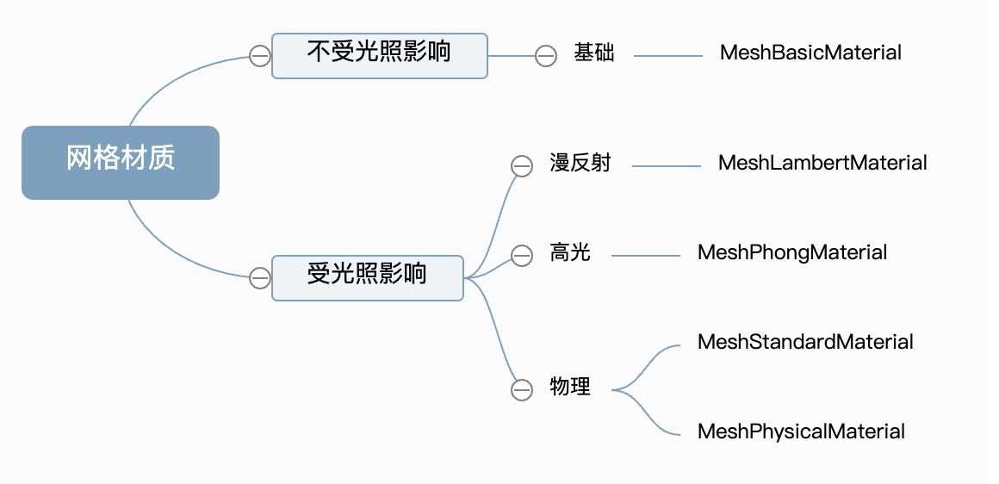
  ### （2）PBR 材质金属度和粗糙度
  ```
    // .metalness 金属度，0 - 1，非金属 0，金属 1，默认是 0
    material.metalness = 1
    // .roughness 粗糙程度，0 - 1，镜面反射 0，漫反射 1，默认是 1
    material.roughness = 0.3
  ```
  ### （3～4）环境贴图 .envMap
  ```
    // 环境贴图 .envMap 模型可以反射周围的景物（更符合现实生活）
    // 上下左右前后 6 张贴图，构成一个立方体空间
    // p：positive 正方向，n：negative 负方向
    // px, nx, py, ny, pz, nz

    // CubeTextureLoader 立方体纹理加载器
    const textureCube = new THREE.CubeTextureLoader()
      .setPath('./环境贴图/环境贴图1/')
      .load([
        'px.jpg', 'nx.jpg', 'py.jpg', 'ny.jpg', 'pz.jpg', 'nz.jpg'
      ])

    // 设置环境贴图
    // 如果场景里没有光源，那么 PBR 材质是黑色的，这时候只加上环境贴图，会发现可以看见了
    // 其实相当于是 贴图里的环境提供了光线
    material.envMap = textureCube

    // 也可以给场景设置环境贴图，这样场景中所有物理材质都会是这个环境贴图（已单独设置的不会被覆盖）
    scene.environment = textureCube
  ```
  ### （5）MeshPhysicalMaterial 透明图层/清漆层
  ```
    const material = new THREE.MeshPhysicalMaterial({
      // 透明图层，0 - 1，默认 0，比如车漆
      clearcoat: 1,
      // 透明图层的粗糙度，0 - 1，默认 0
      clearcoatRoughness: 0
    })
  ```
  ### （6）MeshPhysicalMaterial 透光率
  ```
    const material = new THREE.MeshPhysicalMaterial({
      roughness: 0,
      // 透光率，0 - 1，默认是 0，比如玻璃、透明或者半透明的塑料
      transmission: 1,
      // 折射率，1 - 2.333。默认为 1.5
      ior: 2
    })
  ```

## 8. 渲染器和前端UI界面
  ```
    // 一、实现 3d 物体悬浮的效果（背景透明）
    const renderer = new THREE.WebGLRenderer({
      // 设置背景色的透明度，默认 false ，是 1，设置 true，是 0
      // alpha: true

      // 实现保存当前 canvas 图的参数
      // whether to preserve the buffers until manually cleared or overwritten. Default is false.
      preserveDrawingBuffer: true
    })

    // 设置背景色的透明度，0 ～ 1
    // renderer.setClearAlpha(0)

    // 设置背景颜色以及透明度
    renderer.setClearColor('red', 0)

    // 二、模型闪烁 
    // 问题：两个 mesh 位置重合，电脑 GPU 无法分清谁在前谁后，所以会闪烁，这就叫深度冲突，即 Z-fighting

    // 修改下位置即可，但如果相机距离模型位置较远，也会
    // 闪烁，因为近大远小，之前设置的 z 轴距离的偏差也会变小，导致电脑无法识别
    // 可以通过设置 logarithmicDepthBuffer 对数深度缓存为 true（在单个场景中处理巨大的比例差异）
    mesh2.position.z = -1

    // 但距离过小，电脑 GPU 也无法识别
    // 距离过小或者重合，设置 logarithmicDepthBuffer 也是无效的
    // mesh2.position.z = -0.000000000001

    // 三、模型加载进度条
    // 实例化加载器对象
    const loader = new GLTFLoader()
    loader.load('./工厂.glb', (gltf) => {}, (res) => {
      const percent = res.loaded / res.total
    })
  ```

## 9. 生成曲线、几何体
  ```
    // 一、几何体 .setFromPoints() 方法
      // 把坐标数据提取出来，赋值给 geometry.attributes.position 属性
    
    const pointsArr = [
      // 三维向量 Vector3 表示的坐标值
      new THREE.Vector3(0, 0, 0),
      new THREE.Vector3(0, 100, 0),
      new THREE.Vector3(0, 100, 100),
      new THREE.Vector3(0, 0, 100)
    ]

    geometry.setFromPoints(pointsArr)

    // 二、曲线 Curve 简介
      //（一）EllipseCurve 椭圆
        // EllipseCurve(aX，aY，xRadius，yRadius，aStartAngle，aEndAngle，aClockwise)
        const ellipse = new THREE.EllipseCurve(0, 0, 100, 50, Math.PI, ((Math.PI * 2)/4)*3, true)
        // getPoints 考虑曲线斜率，斜率变化快，返回的顶点更多
        const points = ellipse.getPoints(50)
        // getSpacedPoints 按照距离等间距返回顶点
        // const points = ellipse.getSpacedPoints(30)
        // points 越多，曲线越光滑
        geometry.setFromPoints(points)
      
      //（二）样条曲线：经过一系列点创建的平滑曲线
        // SplineCurve、CatmullRomCurve3
          const arr = [
            new THREE.Vector2(10, -10),
            new THREE.Vector2(-20, 20),
            new THREE.Vector2(60, 60)
          ]
          const splineCurve = new THREE.SplineCurve(arr)
          const points = splineCurve.getPoints(50)
          geometry.setFromPoints(points)

          const arr = [
            new THREE.Vector3(10, -10, 60),
            new THREE.Vector3(-20, 20, 0),
            new THREE.Vector3(60, 60, -60)
          ]
          const catmullRomCurve = new THREE.CatmullRomCurve3(arr)
          const points = catmullRomCurve.getPoints(50)
          geometry.setFromPoints(points)

      //（三）贝塞尔曲线：二次贝塞尔曲线、三次贝塞尔曲线
        // 二次：起点、终点、1个控制点
        // 三次：起点、终点、2个控制点

        // 1. 二维二次贝塞尔曲线 QuadraticBezierCurve(起点，控制点，终点)
          const arr = [
            new THREE.Vector2( -10, 0 ),
            new THREE.Vector2( 20, 15 ),
            new THREE.Vector2( 10, 0 )
          ]
          const quadraticBezierCurve = new THREE.QuadraticBezierCurve(...arr)
          const points = quadraticBezierCurve.getPoints(50)
          geometry.setFromPoints(points)

        // 2. 三维二次贝塞尔曲线 QuadraticBezierCurve3
        // 点数据是 Vector3

        // 3. 二维三次贝塞尔曲线 CubicBezierCurve(起点，控制点1，控制点2，终点)
          const arr = [
            new THREE.Vector2(-10, 0),
            new THREE.Vector2(10, 15),
            new THREE.Vector2(20, 18),
            new THREE.Vector2(30, 5)
          ]
          const cubicBezierCurve = new THREE.CubicBezierCurve(...arr)
          const points = cubicBezierCurve.getPoints(50)
          geometry.setFromPoints(points)

        // 4. 三维三次贝塞尔曲线 CubicBezierCurve3
        // 点数据是 Vector3

      //（四）样条、贝塞尔曲线应用：飞线，比如地球、地图上的飞线
      // 🌰：已知两点坐标，生成一条轨迹飞线，曲线有一定的高度
      // 思路：计算中点坐标，再定义高度，然后连接成曲线

      //（五）CurvePath 拼接曲线
      // 注意：组成曲线的坐标顺序、线条组合的顺序不能随意写，要从一个方向出发，确保他们是首尾相接
      // 🌰：画一个 U 形
      // 思路：两条直线 + 半圆
        const curvePath = new THREE.CurvePath()
        curvePath.curves.push(line1, arc, line2)
        const points = curvePath.getPoints(10)
        geometry.setFromPoints(points)

      //（六）曲线路径管道 TubeGeometry 沿着三维曲线
        const geometry = new THREE.TubeGeometry(catmullRomCurve, 20, 5)

      //（七）旋转成型 LatheGeometry 利用二维轮廓，经过旋转（默认是绕着Y轴）生成3D几何体曲面
      // LatheGeometry(points, segments, phiStart, phiLength)
      // points Vector2 表示的坐标数据组成的数组，x 必须大于 0 
        const splineCurve = new THREE.SplineCurve(arr)
        const points = splineCurve.getPoints(50)
        const geometry = new THREE.LatheGeometry(points, 30, 0, Math.PI*2)

      //（八）Shape、ShapeGeometry、ExtrudeGeometry
      // Shape，多边形轮廓，Shape(points)，points 为 Vector2 数组
      // Shape，.currentPoint 当前点
      // .moveTo(x, y) 可以改变，执行其他绘制方法也能改变，比如 .lineTo
        // 1. 绘制矩形加扇形
          const shape = new THREE.Shape()
          shape.lineTo(60, 0)
          // arc 的圆心坐标是相当于当前的 currentPoint 而言的
          // absarc 是以坐标原点而言的
          shape.arc(0, 0, 30, 0, Math.PI / 2)
          shape.absarc(60, 0, 30, 0, Math.PI / 2)
          shape.lineTo(0, 30)

        // 2. 定义 shape 上的孔洞: .holes path 数组
          const path1 = new THREE.Path()
          path1.absarc(10, 10, 5)
          const path2 = new THREE.Path()
          path2.absellipse(25, 25, 10, 6)
          shape.holes.push(path1, path2)

        // 3. ShapeGeometry(shapes: Array, curveSegments: Integer)
          const geometry = new THREE.ShapeGeometry(shape)

        // 4. ExtrudeGeometry(shapes: Array, options: Object)
        // 扫描轨迹：创建轮廓的扫描轨迹(3D样条曲线)
          const curve = new THREE.CatmullRomCurve3([
            new THREE.Vector3(20, 20, 0),
            new THREE.Vector3(10, 0, 0),
            new THREE.Vector3(8, 50, 50)
          ])
          const geometry = new THREE.ExtrudeGeometry(shape, {
            // 拉伸长度
            depth: 10,
            // 生成斜角，默认是 true
            bevelEnabled: false,
            // 拉伸轨迹
            extrudePath: curve,
            // 拉伸出的几何体分几段
            steps: 100,
            // 曲线上点的数量
            curveSegments: 1
          })

        // 5. 模型边界线 EdgesGeometry
          const edgesGeometry = new THREE.EdgesGeometry(geometry, 1)
          const edgesModel = new THREE.LineSegments(edgesGeometry, new THREE.LineBasicMaterial({
              color: 0x00ffff
          }))

      //（九）几何体顶点颜色数据和应用
        // 1. .attributes.color 和 .attributes.position 一一对应
        // 3 个为一组，R，G，B
        // 材质需要设置 .vertexColors 为 true，是否使用顶点着色。默认值为false

          const geometry = new THREE.BufferGeometry()
          const vertices = new Float32Array([
              5, 5, 0,
              50, 5, 0,
              50, 50, 0
          ])
          geometry.attributes.position = new THREE.BufferAttribute(vertices, 3)

          const colors = new Float32Array([
              1, 0, 0, // 红
              0, 0, 1, // 蓝
              0, 1, 0 // 绿
          ])
          geometry.attributes.color = new THREE.BufferAttribute(colors, 3)

        // 2. 颜色插值
        // lerpColors(c1, c2, percent)
        // percent 代表 c2 的比例，c1 的比例为 1 - percent
        // r = c1.r * (1 - percent) + c2.r * percent
        // g、b 也是如此计算 
          const c1 = new THREE.Color(0.6, 0.2, 0.1)
          const c2 = new THREE.Color(0.4, 0.8, 0.9)
          const mix = new THREE.Color()
          mix.lerpColors(c1, c2, 0.4)
        
        // lerp(c2, percent)
        // c1.lerp(c2, percent) 混合后的值直接赋值给 c1 
        // 可通过 .clone() 一个新的颜色对象，避免 c1 被修改
        // c1.lerp(c2, 0.4)

        // 3. 查看或设置 gltf 几何体顶点 & 山脉高度可视化
          const pos = mesh.geometry.attributes.position
          // .getX(index) .getY(index) .getZ(index)
          // .setX(index, value) .setY(index, value) .setZ(index, value)
          const y = pos.getY(i)

          // 山脉高度可视化
            // （1）两种颜色表示山脉高度可视化
              // 我自己的算法：直接拿当前的高度 / 最高点，但其实这样不准确，因为这样会导致部分颜色出不来，可视化效果不准确（比如高度的最小值就是 300）
              // 准确的算法：求出山的高度，然后拿每一个高减去最小高，这样才能准确算出比例

            // （2）三种颜色表示山脉高度可视化
              // 根据计算出的比例，做是否大于 0.5 的判断，然后插值不同的颜色
  ```

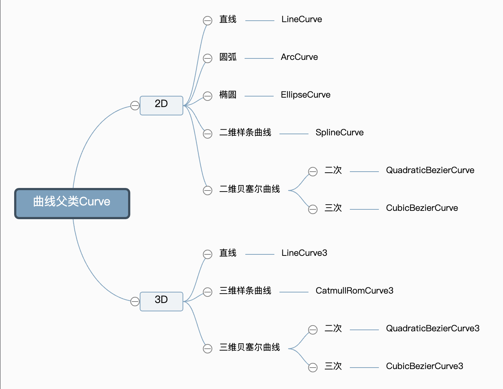
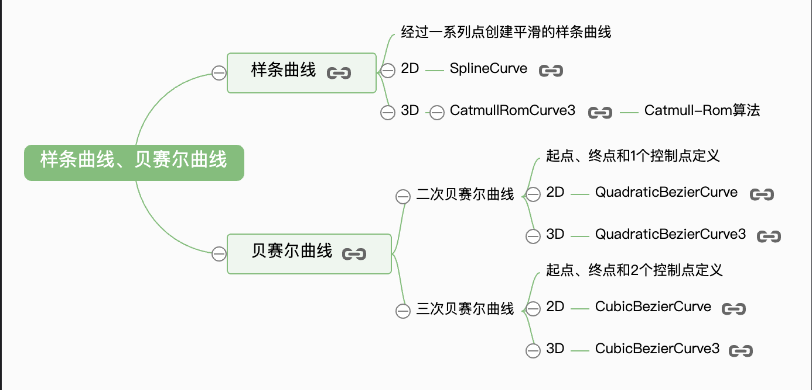
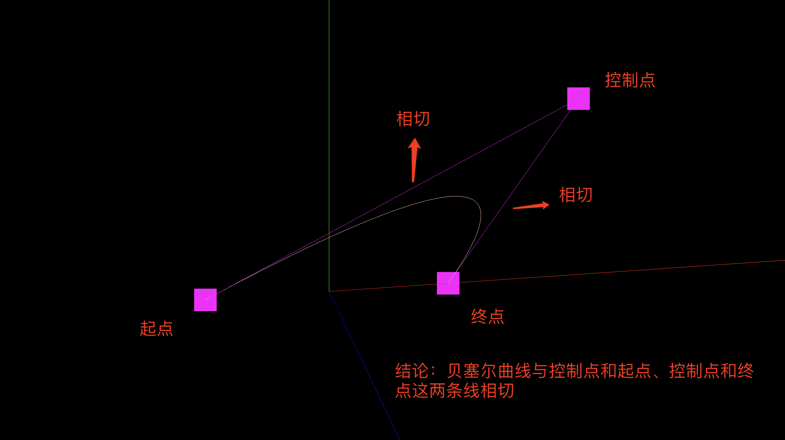
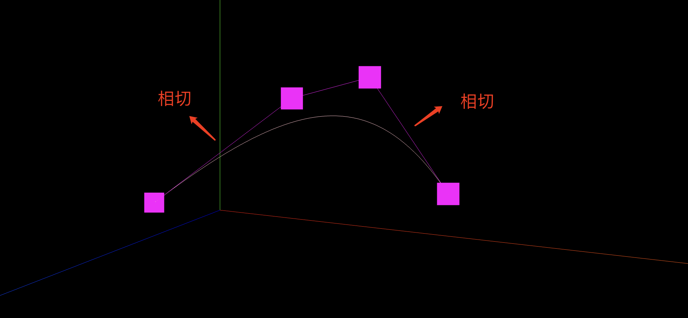
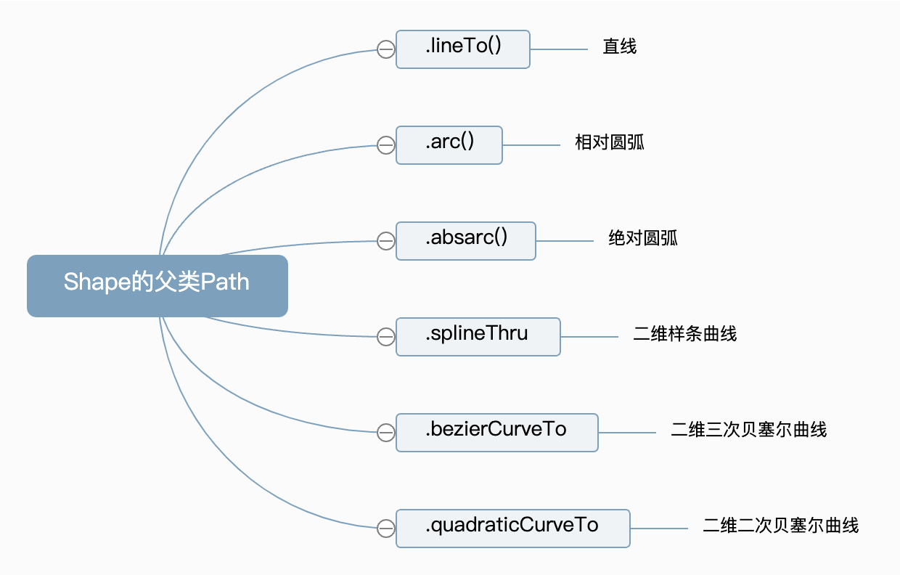
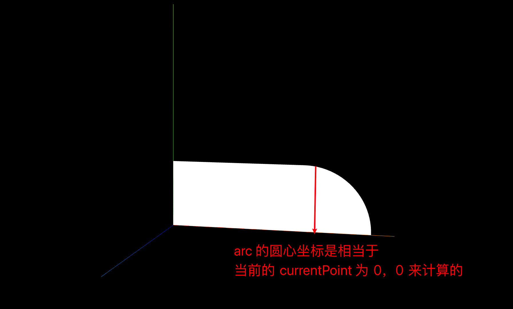

## 10. 相机基础
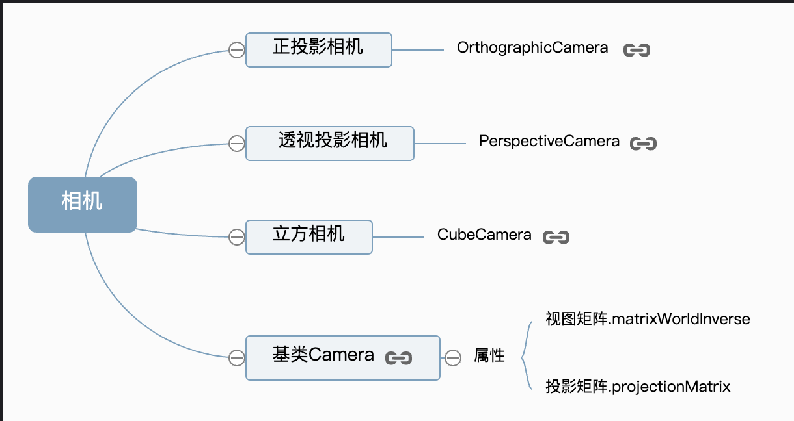
  ### 10.1 正投影相机
  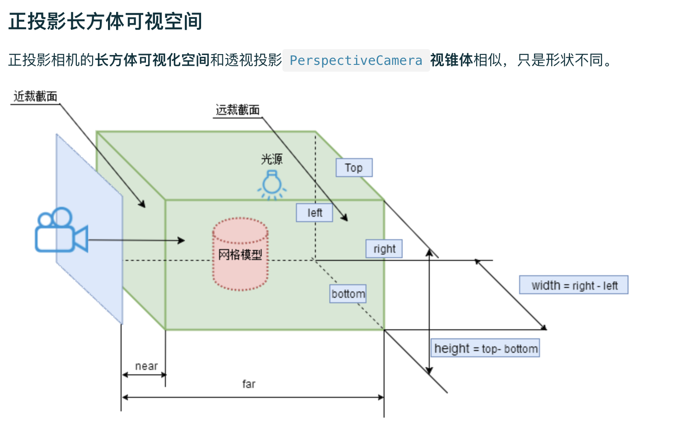
  ```
    // 正投影相机 OrthographicCamera( left : Number, right : Number, top : Number, bottom : Number, near : Number, far : Number )
    // 区别：透视投影可以模拟人眼观察世界的视觉效果，正投影相机不会
    const aspect = width / height // 宽高比
    const s = 500 // 控制 left、top、bottom、right 范围
    const camera = new THREE.OrthographicCamera(-s * aspect, s * aspect, s, -s, 1, 400)

    // 画布跟随窗口变化
    window.onresize = function () {
      renderer.setSize(window.innerWidth, window.innerHeight)
      const aspect = window.innerWidth / window.innerHeight //canvas画布宽高比
      camera.left = -s*aspect
      camera.right = s*aspect
      camera.updateProjectionMatrix()
    }
  ```
  ### 10.2 包围盒 Box3 & 地图案例
  ```
    // 包围盒：把模型的所有顶点数据包围在一个最小的长方体空间中
    const box3 = new THREE.Box3()
    // .expandByObject 计算该模型的包围盒 
    box3.expandByObject(group)
    // .getSize 获取包围盒的长宽高
    const scale = new THREE.Vector3()
    box3.getSize(scale)
    // .getCenter 获取包围盒的中心点
    const center = new THREE.Vector3()
    box3.getCenter(center)

    // 地图案例思路
    // s1: 地图数据转为二维向量
    // s2: 点数据给到 shape，出现地图形状
    // s3: 根据包围盒，计算中心点（相机看向中心）、计算尺寸（调整相机参数）
  ```
  ### 10.3 相机动画(.position和.lookAt())
  ```
    // let angle = 0
    // const R = 100
    function render() {
      renderer.render(scene, camera)
      requestAnimationFrame(render)

      // 一、相机直线运动
      // 修改 .position 属性后，如果不执行 .lookAt 方法，观察方向是默认的，会一直变化
      // camera.position.y += 0.1
      // camera.lookAt(13, 3.7, -25.2)

      // 二、相机圆周运动
      // angle += 0.01
      // camera.position.x = R * Math.cos(angle)
      // camera.position.z = R * Math.sin(angle)
      // camera.lookAt(13, 3.7, -25.2)
    }
  ```
  ### 10.4 不同方向的投影视图 & 旋转渲染结果(.up相机上方向)
  ```
    // 正视图
    // camera.position.set(center.x, center.y, 300)
    // .up 相机的 上方向 属性，默认是(0, 1, 0)，y 的正半轴朝上
    // .up 如果在 .lookAt 之后执行，需要重新执行 .lookAt
    // camera.up.set(0, -1, 0) // y 的负半轴朝上
    // camera.up.set(1, 0, 0) // x 的正半轴朝上
    // camera.up.set(-1, 0, 0) // x 的负半轴朝上
    // camera.lookAt(center.x, center.y, 0)

    // 侧视图
    camera.position.set(center.x + 300, center.y, 0)
    // camera.up.set(0, 0, 1) // z 的正半轴朝上
    camera.up.set(0, 0, -1) // z 的负半轴朝上
    // camera.lookAt(center.x, center.y, 0)

    // 俯视图
    // camera.position.set(center.x, center.y + 300, 0)
    // camera.lookAt(center.x, center.y, 0)
  ```
  ### 10.5 管道漫游案例
  ```
    // 思路分析：
    // s1: 样条曲线 + TubeGeometry
    // s2: 贴图，设置合适的 repeat
    // s3: 相机位置：取一些点 -> 当前点的位置 + 下一个点的位置（相机 + 朝向）+ 动态循环
  ```
  ### 10.6 OrbitControls 旋转缩放限制 & 相机控件MapControls
  ```
    // OrbitControlsn 旋转缩放限制
    // 禁止右键平移 .enablePan
    controls.enablePan = false
    // 禁止缩放 .enableZoom zoom 也还是生效，不过是范围小了，还影响 正投影缩放范围 的设置生效
    // controls.enableZoom = false
    // 禁止旋转 .enableRotate
    // controls.enableRotate = false
    // 设置透视投影相机缩放范围
    // controls.maxDistance = 318
    // controls.minDistance = 58
    // 设置正投影缩放范围
    // controls.minZoom = 0.5
    // controls.maxZoom = 1

    // 设置旋转范围
    // 上下旋转 0 ～ 180 度
    // controls.minPolarAngle = 0
    // controls.maxPolarAngle = Math.PI / 2
    // 左右旋转
    // controls.minAzimuthAngle = 0
    // controls.maxAzimuthAngle = -Math.PI / 2
  ```
# 四、实际遇到的问题
## 1. 直接照着第 11 节敲代码，本想着一步步来，先创建三要素，然后看效果慢慢加，但是总是出不来效果，分析后原因如下：
  （1）材质问题

    MeshBasicMaterial：基础网格材质，不受光照的影响
    MeshLambertMaterial：Lambert 网格材质，需要光照，否则就是黑色的

  （2）相机位置不对
## 2. 有光照的情况下，为什么 MeshLambertMaterial 材质不显示？
## 3. 代码没有光照的情况下，只有基础网格材质可以显示？如果美术模型里有光照呢？也会这样么？还是取决于美术模型里各个物体的材质呢？
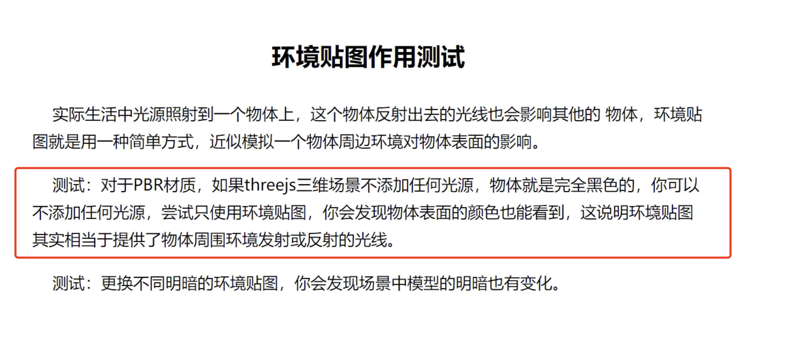
## 4. 第 9 章中，关于生成圆弧顶点的三角函数如何运用计算的？
## 5. 第 10 章中，.up 相机的 上方向 属性，目前理解的是 x、y、z 轴这个谁在上方向，但具体用途不清楚，而且经过测试，除了某个轴在正上方外，也受相机位置影响，会出现角度旋转（camera.up.set(0, 1, 1)）和设置的轴不会在正上方（正视图下设置 z 轴朝上）
  其实就是旋转整个渲染结果
## 6.  第 10 章中，OrbitControls 禁止缩放 .enableZoom zoom 也还是生效，不过是范围小了，还影响 正投影缩放范围 的设置生效
  `controls.enableZoom = false`